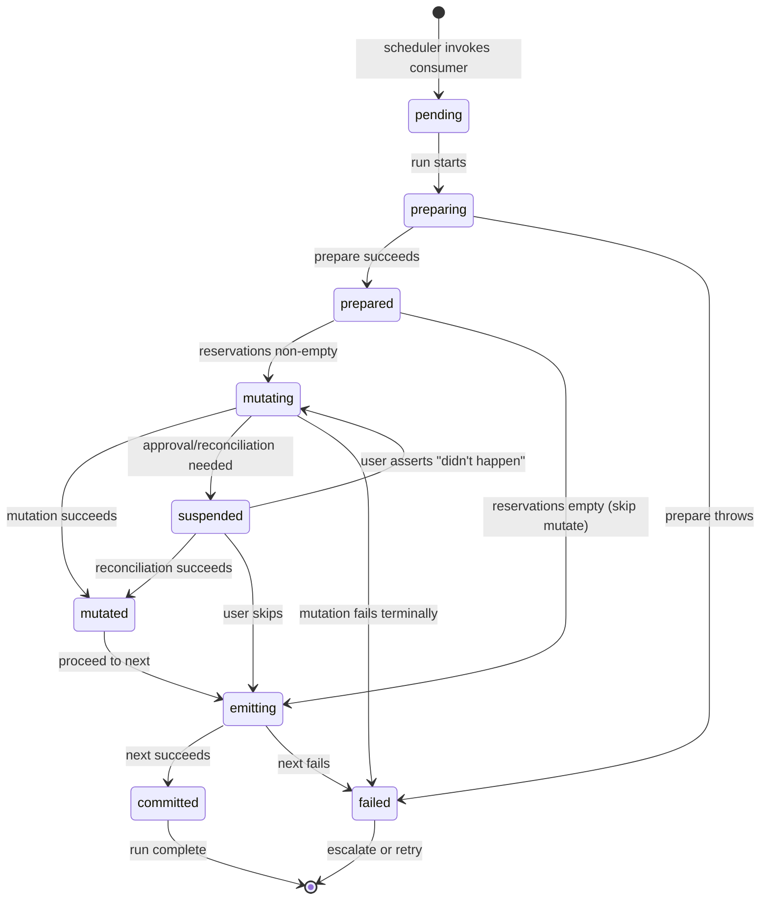

# 06. Execution Model (v1)

This chapter defines the **v1 execution model** for Keep.AI automations.

The goal is **correctness, observability, and safety under suspension**, even at the cost of throughput or flexibility. Performance and concurrency optimizations are explicitly out of scope for v1.

---

## Rationale

Keep.AI executes automation code that is **generated, repaired, and evolved by LLMs**, against **external systems that are unreliable, stateful, and outside our control**. Unlike interactive agents, workflows are expected to run **autonomously**, over long periods of time, while remaining **safe, explainable, and correct**.

Several constraints make a naïve "run the free-form code top-to-bottom" execution model insufficient:

* **Execution may be suspended at arbitrary points** due to permission requests, user approvals, retries, rate limits, or reconciliation of uncertain external side-effects.
* **Code is untrusted by default** (authored by LLMs, possibly influenced by external data) and must be sandboxed and constrained without eliminating its ability to solve real problems using general-purpose programming.
* **External environments are mutable and non-deterministic**: data may change between retries, network calls may return uncertain results with unpredictable latency.
* **Workflows must continue autonomously under transient failures**, while still giving users clear visibility and control when human intervention is required.
* **LLMs must retain expressive freedom** to implement non-trivial logic (parsing, transformation, correlation), but without being able to violate safety, idempotency, or delegation guarantees.

These constraints rule out several common approaches:

* long-lived VM execution (cannot suspend safely),
* implicit retries (cause duplicate side-effects),
* fully dynamic replanning (breaks approvals, observability and security),
* or rigid no-code DAGs (too restrictive for LLM-authored logic).

The execution model defined in this chapter addresses these constraints by **explicitly structuring automation into durable, inspectable units of work**, separating *selection* from *mutation*, and making all side-effects and blocking points first-class runtime concerns. It enforces just enough structure to guarantee correctness and explainability under suspension and failure, while still allowing LLMs to use general-purpose code to solve problems.

This model is intentionally conservative for v1: it prioritizes **correctness, debuggability, and user trust** over throughput or parallelism. It provides a stable foundation on which more advanced execution patterns can be introduced later without weakening the delegation contract.

---

## High-Level Architecture

A workflow consists of **events** and **handlers**.

**Events** are the units of work — durable records stored in topic-based streams. Each event represents something that happened (an email arrived, a row was created) and flows through the workflow until processed.

**Handlers** are the code that processes events. There are two types:

* **Producers** — read-only ingress handlers that poll external systems and enqueue events into topics
* **Consumers** — processing handlers that:
  * select input events from topics
  * perform **exactly one** external mutation
  * optionally emit downstream events to other topics

All handler execution happens in a **JS sandbox** with all external access capabilities controlled by host.

### Handler Isolation

Although a workflow is defined as a single script file, **each producer and consumer runs in its own isolated execution context**. There is no shared in-memory state between handlers — they communicate through Topics, and each handler has its own persistent state (received as input, returned as output). Use of shared global variables across handlers is a **logic error**: LLMs are prompted to avoid this pattern, and script validation may reject it via static analysis.

This isolation:

* Prevents implicit coupling between components
* Ensures each handler can be suspended, restarted, or retried independently
* Enables future parallel execution of independent handlers
* Makes the data flow between components explicit and observable

When reasoning about workflow execution, treat each producer and consumer as a separate program that reads from and writes to durable storage, not as functions sharing a runtime.

---

## Core Principles

1. **Single-threaded correctness**

   * At most **one workflow run is active at any time**
   * At most **one mutation operation per workflow** is active
   * If a run blocks (approval, reconciliation, failure), the entire workflow pauses

2. **Durable delegation**

   * Automations are treated as **delegated jobs**
   * Any best-effort behavior is made **fully observable**
   * The system must be able to explain:

     * what inputs were selected
     * what mutation was attempted
     * why it is blocked or failed

3. **Explicit effects**

   * External side-effects are **never implicit**
   * All mutations go through host-enforced permissions, idempotency, and reconciliation
   * Scripts never directly manage retries or uncertain commits

---

## Topics

A **topic** is a durable, append-only event stream.

### Event Schema

Each event has:

* `topic`
* `messageId` (stable, caller-provided or host-generated)
* `title` (human-readable, required for observability)
* `payload`
* host-managed metadata (not exposed to scripts):

  * `status` — `pending`, `consumed`, `skipped`
  * `reserved_by` — (optional) reference to the consumer run that has reserved this event
  * `created_by` — reference to producer run that created the event

### Event Titles

Event titles are a **delegation interface**, not decoration. They are surfaced in execution traces, notifications, and escalation prompts.

Requirements:

* Includes a stable external identifier
* Includes a human-recognizable descriptor
* Describes *what the event represents*, not how it's processed

Good: `Email from alice@example.com: "Invoice December"`
Bad: `Processing item` or `Email #5`

### Event Lifecycle

Events transition through states:

* `pending` — awaiting processing
* `consumed` — successfully processed by a consumer run
* `skipped` — explicitly skipped by user action

State transitions are **host-managed**. Scripts never manually dequeue or mark events.

### Properties

* Topics are **fully observable** in the UI
* Events are **not deleted by default** — they are marked as consumed/handled
* Topics have **exactly one consumer** in v1
* Topics may be used as:
  * ingress (emails, Slack messages, timers)
  * internal workflow edges (output of one consumer becomes input to another)

---

## Producers

### Purpose

Producers convert unstructured external inputs into **formal system events**.

### Rules

* Producers:

  * may perform **read-only** external operations
  * may enqueue events into topics; publishing is idempotent and deduplicated by `messageId`
* Producers:

  * **may not perform external mutations**
  * **may not consume events**

### Handler State

Producers typically need to track ingress position (cursors, checkpoints) to avoid re-processing the same external data on each invocation.

State is managed through **functional return values**, not imperative storage:

* The producer receives its previous state as a parameter (undefined on first run)
* The producer returns its new state
* State is committed atomically with event publishes on successful completion

```js
producers: {
  async pollEmail(ctx, state) {
    const cursor = state?.cursor;
    const emails = await ctx.gmail.search({ query: "newer_than:24h", after: cursor });

    for (const e of emails) {
      await ctx.publish("email.received", {
        messageId: e.id,
        title: `Email from ${e.from}: "${e.subject}"`,
        payload: { subject: e.subject, from: e.from },
      });
    }

    return { cursor: emails.lastCursor };
  }
}
```

### State Semantics

* State is the **script's own data** — the host does not interpret or enforce any structure
* State should be kept small; the only constraint is a size limit (implementation-defined)
* State is committed atomically with event publishes on successful completion
* If producer crashes or fails, state is not updated; on relaunch, producer re-runs with previous state
* Since event publishing is idempotent by `messageId`, re-processing the same inputs is safe

### Replay Semantics

Producers can be relaunched freely (on crash, exception, or scheduled retry):

* Only side effect is publishing events, which is idempotent
* State saved only on successful completion
* On relaunch, producer may re-poll external sources and re-publish events; duplicates are deduplicated by `messageId`

---

## Consumers

A **consumer** processes events from one or more subscribed topics and performs **at most one external mutation per run**.

### Subscriptions

* A consumer declares which topics it subscribes to
* A consumer may subscribe to **multiple topics**
* The scheduler invokes a consumer when pending events exist in **any** of its subscribed topics
* During `prepare`, the consumer may:
  * **peek** pending events from any subscribed topic (explicit operation)
  * declare **reservations** for 0, 1, or more events from any subscribed topics (via PrepareResult)
* Accessing non-subscribed topics is an error
* Events are stored in append order, but there is no implicit ordering guarantee — consumers may selectively reserve, effectively "skipping" events; FIFO processing is the consumer's responsibility if needed
* See Chapter 16 for scheduling semantics

### Selective Reservation Considerations

Consumers may selectively reserve events (e.g., waiting for correlation across topics, filtering by criteria). This creates scenarios the scheduler and UI must handle:

* **Empty reservations / backoff**: When `prepare` returns empty reservations, the scheduler applies backoff to avoid busy-looping (see Chapter 16)

* **Perpetually pending events**: An event may never be reserved if its correlation never arrives. The UI surfaces stale pending events and allows users to manually skip them (see Chapter 17)

* **Peek performance**: If a topic accumulates many pending events, peeking all of them may be expensive. Pagination or limits on peek may be needed (post-v1 concern).

* **Semantic ordering**: If processing order matters semantically (e.g., "process A before B"), the script must enforce this via its own state checks. The runtime does not enforce semantic dependencies.

### Run Identity

Each consumer run is assigned a unique **run identifier** by the host at creation. This identifier:

* keys the mutation ledger (see Chapter 13)
* tracks run state across suspensions
* is internal to the host — scripts do not interact with it

---

## Consumer Execution Model

Consumers are structured as **three explicit phases**:

```
prepare → mutate → next
```

This structure is enforced by the host.

---

## Phase 1: `prepare`

### Purpose

* Select and pin **exact inputs**
* Compute all data needed for mutation
* Declare what events will be consumed if the consumer run succeeds

### Signature

```ts
async prepare(ctx, state) { ... }
```

Where `state` is the consumer's previous state from the last successful run (undefined on first run).

### Allowed Operations

* Read-only connector calls
* Queue reads: `peek`, `getByIds`
* Local computation
* Building payloads and previews

### Forbidden Operations

* External mutations
* Publishing events
* Consuming events

### Replay Semantics

`prepare` can be relaunched freely because it has no external side effects. On relaunch:

* External reads may return different data (acceptable — no side effects yet)
* PrepareResult is computed fresh

### Indeterminism Handling

`prepare` may use time and randomness. Keep.AI does not aim to allow deterministic replay of `prepare` in v1 because prepare has no external side-effects and its output is persisted atomically only on success. For Maintainer, the runtime provides all tool call traces and logs. Future versions may add capture/replay of nondeterministic sources for improved reproducibility.

### Output

`prepare` must return a **PrepareResult**:

```ts
{
  reservations: Array<{
    topic: string,
    ids: string[]
  }>,
  data: { ... },               // payload needed for mutate and next
  ui?: { ... }                 // optional UX metadata (previews, summaries)
}
```

`prepare` may return **empty reservations** to indicate "nothing to do right now" (e.g., waiting for a time window, batching threshold not met, required correlation event not yet available). In this case, the run skips `mutate` and proceeds directly to `next`. How this outcome informs the scheduler is an open question.

### Semantics

* The host **persists the PrepareResult atomically**
* The data and reservation are considered **pinned**
* No other consumer run may start until this run resolves

### Reservations and Commit Semantics

The `reservations` field declares **exactly which existing events this run intends to consume if it commits successfully**. Reservations are the cornerstone of Keep.AI's commit semantics: they bind a planned mutation to a specific, finite set of inputs before any side-effects occur. The runtime uses reservations to pin inputs during suspension (approvals, retries, reconciliation), to ensure that the mutation is applied **at most once** and **only in response to those inputs**, and to make partial progress fully observable. Reserved events are not consumed immediately; they are atomically marked as reserved on `prepare` success, and later as consumed only after `mutate` and `next` complete successfully. If a run fails or the mutation becomes indeterminate, reservations remain unconsumed and linked to the run, allowing the user to inspect exactly which inputs were involved and to resolve or retry safely without hidden reprocessing or drift.

---

## Phase 2: `mutate`

### Purpose

Perform **exactly one external mutation**.

### Allowed Operations

* **At most one mutator call**
* Read-by-ID operations only: `getById`, `getByUniqueKey`

### Forbidden Operations

* List/search/scan reads
* Queue peeks
* Publishing events
* Multiple mutations

### Mutation is Terminal

The mutation call is the **last operation** in the `mutate` handler. Once a mutation call starts:

* The script is effectively done — host takes over
* Any code after the mutation call is a **logic error**
* The host may enforce this statically or abort if violated

The mutation result is **not returned by the script**. The host captures the result from the mutation ledger and passes it to `next`.

### Signature

```ts
async mutate(ctx, prepared) {
  // ... read-by-id, compute ...
  await ctx.gmail.send({ to, subject, body }); // TERMINAL
  // NO CODE HERE — logic error if present
}
```

### Host-Owned Execution

Once mutation enters `in_flight` state:

* Host records the attempt in the mutation ledger
* Host executes the external call
* Host handles the outcome:
  * Success → record `applied`, proceed to `next`
  * Transient failure → retry with backoff
  * Indeterminate → reconciliation (see Chapter 13)

**The `mutate` handler is NOT re-executed during reconciliation.** Reconciliation is entirely host-owned.

### When Mutate Re-executes

The `mutate` handler only re-executes if:

* Mutation status is `failed` (safe to re-attempt)
* User chose "It didn't happen" on an indeterminate mutation (marks it `failed`)

On re-execution, `mutate` runs with the **same PrepareResult** but may read different external state (via read-by-id). This may produce a **different mutation**, which is acceptable because the previous mutation definitively did not occur.

### Allowed Read Operations in `mutate`

During `mutate`, consumers are permitted to perform **read-by-identifier** operations (such as `getById` or `getByUniqueKey`). These reads are necessary to support common integration patterns where external systems do not provide atomic *upsert* or conditional mutation APIs. In such cases, the script must determine whether a target object already exists (e.g., "insert vs update") immediately before performing the mutation. Disallowing all reads in `mutate` would make the use of these integrations impractical or force runtime into emulating these complex transactions. Allowing narrowly scoped, identifier-based reads preserves the ability to express real-world connector logic in code while keeping mutation semantics bounded and auditable.

---

## Phase 3: `next`

### Purpose

* Produce downstream workflow events derived from the mutation result
* Return updated consumer state

### Signature

```ts
async next(ctx, prepared, mutationResult) {
  // ... publish events, compute new state ...
  return { counter: (state?.counter ?? 0) + 1 };  // optional state update
}
```

Where:

* `prepared` — the PrepareResult from phase 1
* `mutationResult` — discriminated union describing the mutation outcome:

```ts
mutationResult:
  | { status: 'applied', result: T }  // mutation succeeded
  | { status: 'none' }                 // no mutation (empty reservations or no mutation call)
  | { status: 'skipped' }              // user skipped an indeterminate mutation
```

### Allowed Operations

* Publishing events to topics
* Local computation

### Forbidden Operations

* External mutations
* External reads
* Queue reads

### State Return

`next` may return a state object that becomes the consumer's persistent state for subsequent runs. This state:

* Is the **script's own data** — the host does not interpret or enforce any structure
* Should be kept small; the only constraint is a size limit (implementation-defined)
* Is **purely optional** — consumers that don't need persistent state simply don't return anything
* Is committed atomically with run completion

Common uses: counters, rate-limit tracking, caching hints. Note that Topics are the primary mechanism for passing data to downstream consumers — state is for the consumer's own bookkeeping.

### Always Executes

`next` **always executes**, including when:

* Reservations were empty (no mutation attempted)
* Mutate had no mutation call
* User chose "Skip" on an indeterminate mutation

This ensures state can always be updated and observability events can be produced. Script must properly handle all mutationResult statuses.

### Replay Semantics

`next` can be relaunched safely:

* Event publishing is idempotent by `messageId`
* State is re-computed and committed on success

### Atomicity

On successful completion of `next`, the host atomically:

* Commits state update
* Marks reserved events as `consumed` (or `skipped` if user skipped)
* Records the run as complete

---

## Run Lifecycle

Each consumer run progresses through states:



---

## Replay Semantics Summary

| Component | Can Relaunch? | Side Effects | Atomicity |
|-----------|---------------|--------------|-----------|
| Producer | Yes | Event publishing (idempotent) | State saved on success only |
| prepare | Yes | None | PrepareResult saved on success |
| mutate | Only if `failed` | External mutation | Host-owned, ledger-tracked |
| next | Yes | Event publishing (idempotent) | State + event consumption atomic |

**Key invariants:**

* Producers can always retry; events are deduplicated
* Prepare can always retry; no side effects
* Mutate only re-executes if mutation definitively failed
* Reconciliation is host-owned; mutate handler not re-executed
* Next can always retry; publishing is idempotent, state committed atomically

---

## Commit Semantics

A run commits successfully when `next` completes. The host atomically:

1. Marks all events from `reservations` as `consumed` (or `skipped` if user skipped)
2. Commits state from `next`
3. Records the run as complete

If the mutation enters an **indeterminate** state:

* Run is suspended
* Reservations remain reserved (not consumed)
* User action required (see Chapter 07)

---

## Internal Infrastructure vs External Tools

Keep.AI distinguishes between **internal infrastructure** (managed by the host with atomic transactions) and **external tools** (accessing remote systems with network uncertainty).

### Internal Infrastructure

**Topics** are internal to Keep.AI:

* No network latency or uncertainty
* Atomic transactions with handler state and run completion
* No reconciliation concept — operations either succeed or fail deterministically
* Host-managed, not connector-based

| Operation | Producer | prepare | mutate | next |
|-----------|----------|---------|--------|------|
| Topic peek | ✗ | ✓ | ✗ | ✗ |
| Topic publish | ✓ | ✗ | ✗ | ✓ |

### External Tools (Tool Wrappers)

Scripts access external systems (APIs, databases, services) through **host-managed tool wrappers**:

| Operation | Producer | prepare | mutate | next |
|-----------|----------|---------|--------|------|
| External read (search/list) | ✓ | ✓ | ✗ | ✗ |
| External read (by-id) | ✓ | ✓ | ✓ | ✗ |
| External mutation | ✗ | ✗ | ✓ (one, terminal) | ✗ |

Tool wrappers enforce:

* **Phase restrictions**: Operations restricted by execution phase (e.g., mutations only in `mutate`)
* **Mutation is terminal**: After a mutation call starts, the wrapper does not return control to the script. Any code after a mutation call is unreachable.
* **Mutation tracking**: Before executing a mutation, the wrapper records `in_flight` state in the ledger (see Chapter 13)
* **Reconciliation**: Uncertain outcomes are resolved via tool-specific reconciliation methods (see Chapter 13)
* **Permission checks**: Every operation is validated against granted permissions (see Chapter 11)

Violations (e.g., attempting mutation in `prepare`) result in immediate abort and are classified as logic errors for repair.

---

## Safety of Reads in `mutate`

To prevent selection drift and livelock:

* **List/search reads are disallowed in `mutate`**
* Only read-by-id or key-based lookups are allowed
* Any selection logic must occur in `prepare`

This guarantees:

* Stable approvals
* No payload churn after suspension
* No hidden replay semantics

Future versions may introduce guarded reads or other guardrails.

---

## Workflow Declaration Shape

```js
export default Keep.workflow({
  name: "example",

  topics: {
    "email.received": {},
    "row.created": {},
  },

  producers: {
    pollEmail: async (ctx, state) => {
      const cursor = state?.cursor;
      const emails = await ctx.gmail.search({ after: cursor });
      for (const e of emails) {
        await ctx.publish("email.received", {
          messageId: e.id,
          title: `Email from ${e.from}: "${e.subject}"`,
          payload: { subject: e.subject, from: e.from },
        });
      }
      return { cursor: emails.lastCursor };
    }
  },

  consumers: {
    processEmail: Keep.consumer({
      subscribe: ["email.received"],

      async prepare(ctx, state) {
        const pending = await ctx.peek("email.received");
        if (pending.length === 0) return { reservations: [], data: {} };
        const event = pending[0];
        return {
          reservations: [{ topic: "email.received", ids: [event.messageId] }],
          data: { email: event.payload }
        };
      },

      async mutate(ctx, prepared) {
        await ctx.sheets.appendRow({
          spreadsheetId: "...",
          values: [prepared.data.email.from, prepared.data.email.subject]
        });
      },

      async next(ctx, prepared, mutationResult) {
        if (mutationResult.status === 'applied') {
          await ctx.publish("row.created", {
            messageId: `row:${prepared.data.email.messageId}`,
            title: `Row created for ${prepared.data.email.from}`,
            payload: { rowId: mutationResult.result.rowId }
          });
        }
        // No state needed for this consumer
      },
    })
  }
});
```

---

## Guarantees (v1)

* **Security**: all mutations are permission-checked and allow explicit approval
* **Determinism**: selected inputs do not change after prepare
* **Observability**: every blocked or failed run is explainable
* **Correctness-first**: no partial commits, no silent inconsistent retries
* **Idempotency**: replay returns cached results, no duplicate mutations

---

## Non-Goals (v1)

* Parallel consumer execution
* Multi-consumer topics
* Dynamic replanning after approval
* High-throughput streaming
* Event reprocessing (see Chapter 20)
* Workflow-scoped shared state (see Chapter 20)

These may be introduced later as explicit extensions.

See also:

* Chapter 16 — Scheduling
* Chapter 17 — Event Management UX
