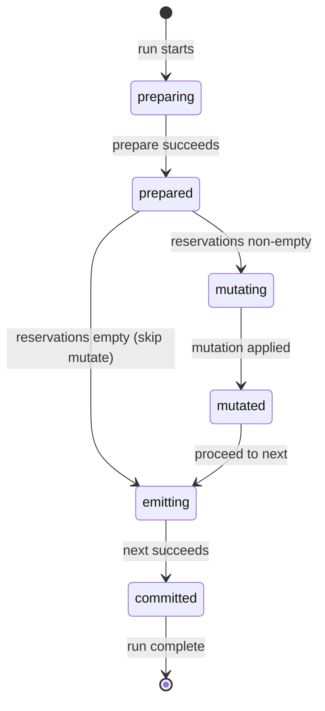

# 06b. Consumer Lifecycle

This chapter defines the detailed execution semantics for consumers.

For the conceptual model, see Chapter 06. For topic and handler definitions, see Chapter 06a.

---

## Three-Phase Model

Consumers execute in **three explicit phases**, enforced by the host:

```
prepare → mutate → next
```

Each phase has strict rules about what operations are allowed. This separation ensures:

* Inputs are pinned before any side-effects
* Mutations are isolated and trackable
* Downstream effects are decoupled from mutation success

---

## Phase 1: prepare

### Purpose

* Select and pin **exact inputs**
* Compute all data needed for mutation
* Declare what events will be consumed if the run succeeds

### Signature

```ts
async prepare(ctx, state) → PrepareResult
```

Where `state` is the consumer's previous state from the last successful run (undefined on first run).

### Allowed Operations

* Read-only external calls
* Topic reads (i.e. `peek`, `getByIds`) for subscribed topics
* Local computation
* Building payloads and previews

### Forbidden Operations

* External mutations
* Publishing events
* Consuming events
* Accessing non-subscribed topics

### Output: PrepareResult

```ts
{
  reservations: Array<{
    topic: string,
    ids: string[]
  }>,
  data: { ... },     // payload for mutate and next
  ui?: { ... },      // optional UX metadata (previews, summaries)
  wakeAt?: string    // optional ISO 8601 datetime for time-based wake (see Chapter 16)
}
```

### Reservations

The `reservations` field declares **exactly which events this run intends to consume if it commits successfully**.

Reservations are the cornerstone of Keep.AI's commit semantics: they bind a planned mutation to a specific set of inputs before any side-effects occur. The runtime uses reservations to:

* Pin inputs during suspension (approvals, retries, reconciliation)
* Ensure the mutation is applied **at most once** for those inputs
* Make partial progress fully observable

Reserved events are marked `reserved` on `prepare` success, then `consumed` only after the full run commits. If a run pauses or is retried, reservations remain in `reserved` state, allowing inspection and safe continuation.

### Empty Reservations

`prepare` may return **empty reservations** to indicate "nothing to do right now":

* Waiting for a time window
* Batching threshold not met
* Required correlation event not yet available

When reservations are empty, the run skips `mutate` and proceeds directly to `next`.

For time-based patterns, `prepare` can include `wakeAt` to request a specific wake time. See Chapter 16 for scheduler handling of empty reservations and the `wakeAt` hint.

### Replay Semantics

`prepare` can be relaunched freely because it has no external side effects. On relaunch:

* External reads may return different data (acceptable — no side effects yet)
* PrepareResult is computed fresh and persisted atomically on success

---

## Phase 2: mutate

### Purpose

Perform **exactly one external mutation**.

### Signature

```ts
async mutate(ctx, prepared) → void
```

The `mutate` handler is a **pure function** of `prepared.data`. All decisions (insert vs update, target selection) must be made in `prepare` and passed via `data`.

### Allowed Operations

* **At most one mutator call**

### Forbidden Operations

* All external reads
* Topic operations (peek, publish)
* Multiple mutations

### Mutation is Terminal

The mutation call is the **last operation** in `mutate`. Once a mutation call starts:

* The script is effectively done — host takes over
* Any code after the mutation call is a **logic error**
* The host may enforce this statically or abort if violated

```ts
async mutate(ctx, prepared) {
  await ctx.gmail.send({
    to: prepared.data.recipient,
    subject: prepared.data.subject,
    body: prepared.data.body
  }); // TERMINAL — no code after this
}
```

The mutation result is captured by the host and passed to `next`.

### Host-Owned Execution

Once mutation enters `in_flight` state:

1. Host records the attempt in the mutation ledger
2. Host executes the external call
3. Host handles the outcome:
   * Success → record `applied`, proceed to `next`
   * Transient failure → retry with backoff
   * Indeterminate → reconciliation (see Chapter 13)

**The `mutate` handler is NOT re-executed during reconciliation.** Reconciliation is entirely host-owned.

### When Mutate Re-executes

The `mutate` handler only re-executes when mutation is in `failed` state:

* Mutation definitively did not commit
* User chose "It didn't happen" on an indeterminate mutation

On re-execution, `mutate` runs with the **same PrepareResult**. This is safe because the previous mutation definitively did not occur.

---

## Phase 3: next

### Purpose

* Produce downstream workflow events derived from the mutation result
* Return updated consumer state

### Signature

```ts
async next(ctx, prepared, mutationResult) → state?
```

Where `mutationResult` is a discriminated union:

```ts
| { status: 'applied', result: T }   // mutation succeeded
| { status: 'none' }                  // no mutation (empty reservations or no mutation call)
| { status: 'skipped' }               // user skipped an indeterminate mutation
```

### Allowed Operations

* Publishing events to topics
* Local computation

### Forbidden Operations

* External mutations
* External reads
* Topic reads

### State Return

`next` may return a state object that becomes the consumer's persistent state:

* State is the **script's own data** — host does not interpret it
* Should be kept small (implementation-defined size limit)
* Committed atomically with run completion
* Optional — consumers without persistent state simply don't return anything

Common uses: counters, rate-limit tracking, caching hints.

### Always Executes

`next` **always executes**, including when:

* Reservations were empty (no mutation attempted)
* Mutate had no mutation call
* User chose "Skip" on an indeterminate mutation

Scripts must handle all `mutationResult` statuses appropriately.

### Replay Semantics

`next` can be relaunched safely:

* Event publishing is deduplicated by `messageId` (last-write-wins, see Chapter 06a)
* State is re-computed and committed on success

---

## Run Lifecycle

### Execution Phase

Each consumer run progresses through **phases**:



**Phase only moves forward.** There is no `failed` state in the phase diagram. Failures pause execution but do not change the phase.

### Run Status (Orthogonal)

Run status tracks *why* a run is paused or stopped. Status is **orthogonal to phase** — a run can be paused at any phase.

| Status | Meaning | Resolution |
|--------|---------|------------|
| `active` | Currently executing | — |
| `paused:transient` | Transient failure, will retry | Backoff then resume |
| `paused:approval` | Waiting for user approval | User approves/rejects |
| `paused:reconciliation` | Uncertain mutation outcome | Reconciliation or user action |
| `failed:logic` | Script error, auto-fix eligible | Auto-fix then retry |
| `failed:internal` | Host/connector bug | Contact support |
| `committed` | Successfully completed | — |

**Critical invariant:** Failures change run status, not phase. When a paused run resumes, it continues from the same phase.

See Chapter 16 for run status management, retry scheduling, and phase reset rules.

---

## Replay Semantics Summary

| Phase | Can Relaunch? | Side Effects | Atomicity |
|-------|---------------|--------------|-----------|
| prepare | Yes | None | PrepareResult saved on success |
| mutate | Only if mutation not applied | External mutation | Host-owned, ledger-tracked |
| next | Yes | Event publishing (idempotent) | State + event consumption atomic |

**Key invariants:**

* Prepare can always retry — no side effects
* Mutate only re-executes if mutation definitively did not apply
* Reconciliation is host-owned — mutate handler not re-executed
* Next can always retry — publishing is idempotent, state committed atomically

**Phase reset:** Before mutation is applied, execution can reset to `prepare` (e.g., for auto-fix). After mutation is applied, execution must proceed through `next`. See Chapter 06 for reset rules.

---

## Commit Semantics

A run commits successfully when `next` completes. The host atomically:

1. Marks all events from `reservations` as `consumed` (or `skipped` if user skipped)
2. Commits state from `next`
3. Records the run as `committed`

If execution pauses (transient failure, approval needed, reconciliation):

* Run status changes (see Run Status table above)
* Phase remains unchanged
* Reservations remain reserved (not consumed)
* Mutation state is preserved
* Execution can resume from the same phase when resolved

---

## Related Chapters

* Chapter 06 — Execution Model (concepts, phase reset rules)
* Chapter 06a — Topics and Handlers
* Chapter 07 — Workflow Operations
* Chapter 09 — Failure Handling (failure classification)
* Chapter 13 — Mutation Reconciliation
* Chapter 16 — Scheduling (run status, retry logic, phase reset implementation)
