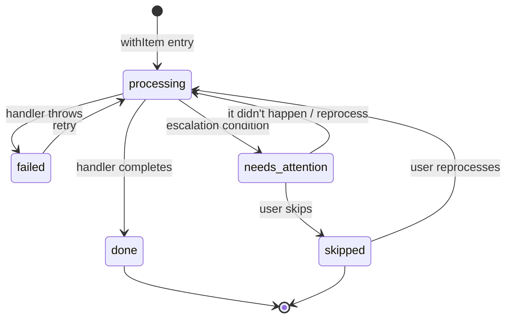

# 12. Logical Items

This chapter defines **logical items** — the fundamental unit of work in Keep.AI automations.

Logical items provide:

* **progress tracking** — what has been processed, what remains
* **observability** — clear visibility into automation state
* **user control** — reprocess, skip, or inspect individual units of work
* **accountability** — meaningful titles that explain what was done

Logical items are also the foundation for idempotent execution (Chapter 14), but their value extends beyond deduplication — they are the primary interface through which users understand and control their automations.

---

## 12.1 Definition

A **logical item** represents a single, independent unit of work processed by an automation.

Examples:

* a specific email
* a database record
* a composite key (e.g. `email_id + contractor_id`)

Logical items must be **independent** — processing one item must not depend on the outcome of another. The runtime does not guarantee any particular ordering, and items may be skipped, retried, or reprocessed individually.

Scripts must not create implicit dependencies between items (e.g., via shared external state). If the domain has inherent dependencies, they must be modeled as a single composite item. Planner and Maintainer agents must be prompted to reject designs that violate item independence.

If a script violates independence and fails unpredictably, the auto-repair loop will attempt fixes. If repairs cannot resolve the issue (e.g., the design is fundamentally flawed), the system escalates with a recommendation to re-plan.

Each logical item is identified by a **stable string identifier** and a human-readable **title**:

```
logical_item_id := string
title := string
```

Logical item IDs must be stable, chosen explicitly by the script, and independent of volatile data. See §12.8 for detailed stability requirements.

Logical item IDs provide correctness. Titles provide accountability and observability — they are surfaced in execution traces, error reports, and escalation prompts.

---

## 12.2 Item scope

Scripts process logical items inside an **item scope**:

```
withItem(logical_item_id, title, handler)
```

The **handler** is a callback function that contains the processing logic for a single item. It receives a context object and executes mutations against external systems. See Chapter 14, §14.2 for handler execution semantics.

Semantics:

* establishes the current logical item
* attaches a meaningful title to the unit of work
* serializes processing for that item
* binds all mutations inside the handler to the item
* provides a durable completion checkpoint

Only one item scope may be active at a time (no nesting). If a script attempts concurrent `withItem` calls (e.g., via `Promise.all`), they are serialized by the runtime.

The scheduler guarantees that **at most one run** of a workflow executes at any time. Combined with the single item scope constraint, this means no concurrent access to items within a workflow — no item-level locking is required.

Mutations within a handler are **strictly sequential** — each tool call blocks until the outcome is determined or the script is aborted. This ensures at most one mutation can be in an uncertain state at the point of abort (see Chapter 13, §13.3 "Sequential execution invariant").

---

## 12.3 Item ledger

The host runtime maintains a durable **item ledger**.

Each item record is keyed by:

```
item_key := (workflow_id, logical_item_id)
```

Each record contains:

* `workflow_id` — the owning workflow
* `logical_item_id` — stable identifier chosen by the script
* `title` — human-readable description
* `status` — current state (`processing`, `done`, `failed`, `skipped`, `needs_attention`)
* `current_attempt_id` — monotonically increasing attempt counter (see §12.5)
* `created_by_run_id` — the run that first created this item
* `last_run_id` — the run that last changed this item's state
* `created_at`, `updated_at` — timestamps

The ledger is written durably:

* on `withItem` entry (creates record if absent, sets `processing`)
* on handler completion (sets `done`)
* on handler failure (sets `failed`)
* on escalation (sets `needs_attention`)

Crash recovery: if the host restarts while an item is `processing`, the item remains in that state. On the next run, the runtime will re-enter the item scope and resume from the mutation ledger state for the current attempt (see Chapter 14).

Item deletion and archival are deferred to v2. For v1, items persist indefinitely; UI filtering handles visibility of old or orphaned items.

---

## 12.4 Item state and lifecycle

The runtime tracks item state durably:

* `processing` — handler is executing (initial state on `withItem` entry)
* `done` — handler completed successfully
* `failed` — handler threw an error
* `skipped` — user explicitly skipped this item
* `needs_attention` — escalation required (indeterminate mutation, etc.)

### State transitions



Notes:

* Items are created on first `withItem` entry, starting in `processing`
* `failed` → `processing` occurs when the runtime decides to retry (transient failure) or after successful auto-repair
* `needs_attention` is resolved by explicit user action only
* `needs_attention` → `processing` can occur via "it didn't happen" (same attempt) or "reprocess item" (new attempt, see §12.5)

Scripts do **not** manage processed state explicitly.

---

## 12.5 Attempts and reprocessing

An **attempt** represents a single pass of processing for a logical item.

Each item has a `current_attempt_id` (starting at 1). Mutations executed within an item are tagged with the current attempt ID.

### Starting a new attempt

A new attempt begins when the user explicitly requests reprocessing:

* **"Start fresh"** — after major version change, reprocess all items
* **"Select items"** — after major version change, reprocess selected items
* **"Reprocess item"** — for a single item in `needs_attention` or `skipped` state

The system never autonomously starts new attempts. All reprocessing decisions are user-initiated.

When a new attempt starts:

* `current_attempt_id` is incremented
* `status` is set to `processing`
* `ctx.item.isDone` reflects the new state (false) — see Chapter 14, §14.2
* previous attempt's mutations remain in the ledger (for traceability)

### Traceability

All attempts are preserved:

* old attempts remain queryable
* UI should display attempt history per item
* mutations are grouped by attempt for clarity

Example UI rendering:

```
Item: Email from alice@example.com "Invoice December"
├─ Attempt 1 (done, script v1.2, 2024-01-15)
│  ├─ gmail.send(to: bob@acme.com) ✓ applied
│  └─ gmail.addLabel(label: "Processed") ✓ applied
└─ Attempt 2 (done, script v2.0, 2024-01-20)  ← current
   ├─ gmail.send(to: bob@acme.com) ✓ applied
   ├─ gmail.send(to: carol@acme.com) ✓ applied
   └─ gmail.addLabel(label: "Processed-v2") ✓ applied
```

This provides full observability while keeping each attempt's execution independent.

---

## 12.6 Namespace and version boundaries

Logical items are scoped to the **workflow**, not to a specific script version.

This means:

* items persist across repairs (minor version changes)
* items persist across re-planning (major version changes)
* item history is visible across all versions of a workflow

### Repairs (minor version changes)

When a script is repaired (Maintainer updates minor version):

* all item state is preserved
* the same `logical_item_id` refers to the same item
* `done` items remain done; processing resumes where it left off

This is the expected behavior for fixing bugs without re-doing work and without user involvement.

### Re-planning (major version changes)

When intent changes and the Planner generates a new major version:

* item records remain in the ledger (for observability and history)
* the system prompts the user: **"Your intent changed. Do you want to reprocess previously completed items?"**

User options (when ID format is unchanged):

* **"Start fresh"** — all items are marked for reprocessing (new attempt)
* **"Keep progress"** — `done` items remain done
* **"Select items"** — user manually selects which items to reprocess

When ID format change is detected, these options are not applicable — there is no continuity between old and new item IDs. The user is informed that all work will be reprocessed under new IDs, and confirms activation. Orphaned item warnings are shown (see "ID format change detection" below).

When an item is marked for reprocessing, a new **attempt** begins (see §12.5). Previous attempts are preserved for traceability.

### Why workflow-scoped?

Scoping items to `workflow_id` rather than `workflow_id + major_version`:

* provides continuity and observability across intent changes
* allows users to see "what was processed before" even after re-planning
* avoids silent data loss when intent evolves
* aligns with the delegation model: user owns intent, including the decision to reprocess

### Item ID compatibility across versions

If a major version change alters the **logical item ID format** (e.g., switching from `email:<id>` to `thread:<id>`), the old and new items are effectively disjoint — the system cannot match them.

In this case:

* old items remain in the ledger with their original IDs
* new runs create new item records and re-process everything under new IDs
* old incomplete items become "orphaned" (not touched by new version)
* **duplicate mutations are possible** — idempotency keys include `logical_item_id`, so the same external operation under different item IDs produces different mutations

### ID format change detection

The Planner's review stage analyzes script changes and detects ID format changes (best-effort, LLM-assisted). When detected:

**Before activation:**
* user is warned: "ID format changed. Existing items will become orphaned."
* orphaned items are listed for review
* user activates with informed consent

**After activation:**
* orphaned items are flagged on the workflow page
* user reviews mutation logs to assess external state
* "Resolve" button marks items `skipped`, clearing the warning

This flow preserves the delegation contract: users are informed of the consequences and given clear actions, rather than being expected to audit Planner's ID choices.

**Limitation:** Detection is best-effort. The Planner is also prompted to preserve ID formats across repairs, but this cannot be enforced deterministically.

**Non-goal:** Automatic migration of items between ID formats. The risk of incorrect mappings outweighs the benefit.

---

## 12.7 User actions on items

### Escalation actions

When an item enters `needs_attention`, the system provides **explicit, actionable choices**:

* **"Try again"** — retry reconciliation for an indeterminate mutation (only available if the mutation has a `reconcile` method; see Chapter 13). This does not start a new attempt.
* **"It didn't happen"** — user asserts mutation did not commit; marks mutation `failed`, allowing the current attempt to retry it
* **"Reprocess item"** — start a new attempt for this item (see §12.5); previous mutations and logs are preserved for traceability
* **"Skip this item"** — mark item `skipped`, proceed with other items

Note: automatic retries (continuing an attempt after transient failures) happen without user involvement on the next scheduled run. Escalation actions are only presented when the system cannot proceed automatically.

### Manual reprocessing

Users may also request reprocessing of `done` or `skipped` items outside of escalation or re-planning contexts.

This is supported through the Items UI, where users can select items and request reprocessing. This starts a new attempt and the next script run will process it.

### Reprocessing decision log (v2)

In v1, reprocessing decisions are reflected only in item state (new attempts). A dedicated decision log with timestamps and user comments would add useful context, but is left for v2.

### Delegation contract

This preserves the delegation contract: users resolve uncertainty about the external world, not internal logic.

---

## 12.8 Logical item ID stability

Logical item identifiers are a **critical correctness boundary** in Keep.AI.

They determine:

* what work is considered the "same item"
* how partial progress is preserved
* whether retries and repairs are safe

Because Keep.AI scripts are generated and modified by LLMs, logical item IDs are **best-effort by construction** and require explicit discipline.

### Responsibility model

Logical item IDs and titles are:

* **chosen explicitly by the script**
* **not inferred or enforced automatically by the runtime**
* **trusted as stable identifiers for correctness**

This means:

* the planner LLM is responsible for selecting appropriate logical item IDs and titles
* code-reviewing LLMs are responsible for validating them
* auto-repair LLMs must treat them as **semantically frozen**

The runtime cannot reliably detect "wrong" logical item IDs — it can only enforce behavior *given* an ID.

Titles do not affect correctness, but they are essential for reviewing, debugging, and resolving best-effort cases involving logical item identity.

### Stability requirements

A logical item ID **must** satisfy all of the following:

1. **Stability across retries**
   The same real-world entity must produce the same logical item ID every time.

2. **Stability across auto-repair**
   Automatic code fixes must not change logical item ID construction.

3. **Independence from volatile data**
   Logical item IDs must not depend on:

   * timestamps
   * counters
   * mutable fields (e.g. "last_updated_at")
   * array positions or iteration order

4. **Intent-level identity**
   IDs should reflect *what the item is*, not *how it is processed*.

Good examples:

* `email:<message_id>`
* `invoice:<invoice_id>`
* `email:<message_id>|contractor:<contractor_id>`

Bad examples:

* `email:<index>`
* `email:<subject>`
* `email:<hash(full_object)>`
* `email:<message_id>:v2` (without explicit intent change)

### Consequences of unstable IDs

If logical item IDs change unintentionally:

* mutations may be re-applied (when combined with idempotency, see Chapter 14)
* partial progress may be duplicated
* user trust is lost

These failures are often **silent at first** and only surface later as duplicated or corrupted external state, hence the mitigations below.

---

## 12.9 LLM agent constraints for item IDs

### Auto-repair constraints

Auto-repair LLMs must obey a strict rule:

> **Logical item ID construction is immutable under auto-repair.**

Auto-repair is allowed to:

* change control flow
* fix tool usage
* add guards or retries
* adjust payload construction

Auto-repair is **not allowed** to:

* change logical item ID formats
* add or remove components of the ID
* switch to a different notion of "item"

If a fix requires a different logical item identity, that must be treated as a **new automation revision**, not a repair. Maintainer agent is prompted to fail explicitly if the fix would require a logical item ID change.

### Code review requirements

Any potential reviewing LLM agent should explicitly check:

* Is the logical item ID derived from a **stable, unique external identifier**?
* Does it match the intended unit of work?
* Will it remain stable if the script is retried tomorrow?
* Does it accidentally collapse multiple real items into one?
* Does it accidentally split one real item into many?

Logical item ID review should be treated with the same seriousness as:

* database primary key design
* idempotency key design
* distributed system identity boundaries

---

## 12.10 Titles and observability

Logical item titles are a **delegation interface**, not decoration. Poor titles undermine observability and make best-effort behavior untrustworthy.

**Checklist for good titles:**

* ✓ Includes a stable external identifier
* ✓ Includes a human-recognizable descriptor
* ✓ Uniquely identifies the item within a run
* ✓ Describes *what the item is*, not how it's processed

**Test:** If this title appears alone in a notification, would the user immediately know what it refers to?

| Anti-pattern | Why it fails | Better alternative |
|--------------|--------------|-------------------|
| `Processing item` | No distinguishing info | `Email from alice@example.com: "Invoice"` |
| `Email #5` | Index unstable across retries | `Email <message_id>: "Subject line"` |
| `Invoice updated at 2024-01-19` | Timestamp drifts | `Invoice #4932 (ACME Corp)` |
| `Invoice processing v2` | Describes process, not item | `Invoice #4932 (ACME Corp)` |
| `gmail.messages.get id=18c7a…` | Implementation details | `Email from sender: "Subject"` |
| `Process invoices` | Refers to many items | One title per item |

---

## 12.11 Best-effort, by design

Keep.AI intentionally does **not** attempt to infer or "fix" logical item IDs automatically.

This is a conscious tradeoff:

* automatic inference would be heuristic and unreliable
* silent corrections would be dangerous
* explicit responsibility keeps failures debuggable

As a result:

* logical item IDs are a **best-effort contract**
* correctness depends on planner and maintainer LLMs discipline
* violations surface early through tracking and reconciliation mechanisms
* logical items are fully observable by user in execution traces

This aligns with Keep.AI's delegation philosophy:

> the system enforces deterministic guarantees rigorously,
> while best-effort behavior is made fully observable.

When correctness cannot be guaranteed, Keep.AI does not hand-wave uncertainty.
It surfaces each affected logical item clearly, with enough context for a user to inspect, accept, or intervene — like a diligent contractor reporting the status of delegated work.

---

## 12.12 Summary

Logical items in Keep.AI:

* represent discrete units of work
* are tracked durably in an item ledger
* provide full observability through titles and attempt history
* give users explicit control (reprocess, skip, inspect)
* require stable IDs chosen by the script
* are workflow-scoped for continuity across versions

This abstraction enables users to understand and control their automations at a meaningful granularity, independent of internal execution details.
