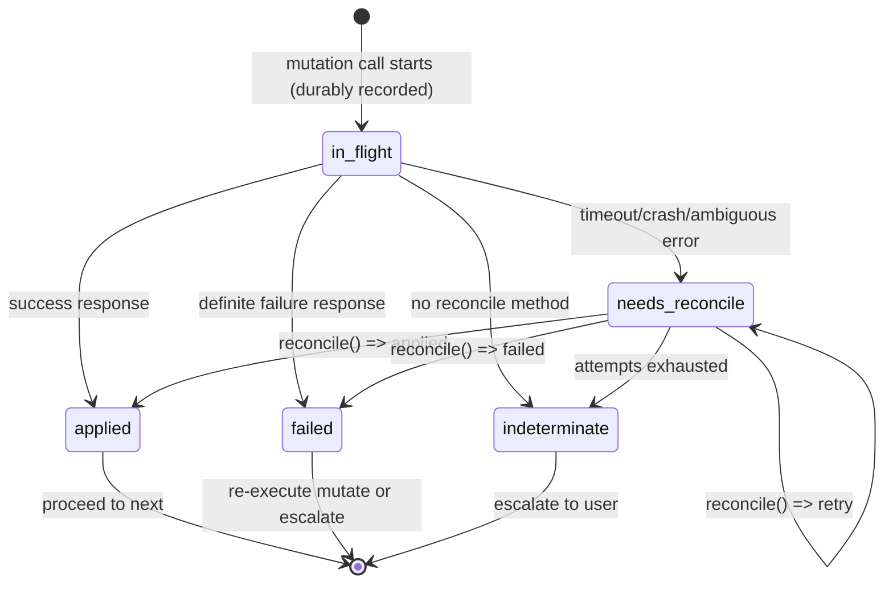

# 13. Mutation Reconciliation

This chapter defines how Keep.AI handles **indeterminate mutation outcomes** when interacting with external systems.

It specifies:

* how mutation attempts are tracked
* how uncertainty is detected
* how reconciliation is performed
* when the system must fail closed and escalate

This mechanism is the **foundation** for idempotent execution guarantees provided by the execution model (Chapter 06).

---

## 13.1 Problem statement

External systems are not transactional.

When the host performs a side-effecting API call, it may encounter outcomes where it is **impossible to know** whether the mutation was applied:

Examples:

* request timed out after being sent
* process crashed mid-call
* network failure after write
* API returned an error indicating uncertain commit (e.g., ambiguous 5xx)
* external service provides no reliable reconciliation mechanism

In these cases:

* retrying may duplicate or corrupt state
* skipping may lose the mutation
* correctness cannot be established deterministically

Keep.AI must explicitly model **unknown outcomes**, reconcile them conservatively, and escalate when correctness cannot be established.

---

## 13.2 Scope and non-goals

### In scope

* per-mutation tracking
* per-tool reconciliation logic
* conservative handling of uncertainty
* escalation when correctness cannot be determined

### Out of scope

* workflow-level retries and scheduling
* script-level control flow
* distributed transactions
* rollback of irreversible external effects

This chapter concerns **one mutation attempt at a time**.

---

## 13.3 Definitions

### One mutation per run

Each consumer run performs **at most one mutation** (see Chapter 06, "Phase 2: mutate"). This is enforced by the host.

This means:

* a consumer run cannot have multiple mutations `in_flight` simultaneously
* if a mutation transitions to `needs_reconcile`, the run is suspended before any further execution
* there is no concurrency between mutations within a single run

This invariant simplifies reconciliation: at most one mutation per run can be in an uncertain state.

### Mutation is terminal

The mutation call is the **last operation** in the `mutate` handler (see Chapter 06, "Mutation is Terminal"). Once a mutation starts:

* the script is effectively done
* host takes over execution
* reconciliation is entirely host-owned — the `mutate` handler is NOT re-executed during reconciliation

### Mutation

A **mutation** is a single side-effecting operation against an external system.

Examples:

* send an email
* create or update a record
* post a message
* trigger a webhook

Each mutation is executed through a host-controlled tool wrapper and tracked independently.

### Indeterminate outcome

An outcome is **indeterminate** when the host cannot reliably determine whether a mutation committed.

Indeterminate outcomes are not safely recoverable by "retrying" unless reconciliation can prove commit or non-commit.

---

## 13.4 Mutation ledger

The host runtime maintains a durable **mutation ledger**.

Each ledger record is keyed by **run identifier** (see Chapter 06, "Run Identity"). Since each consumer run performs at most one mutation, the run identifier uniquely identifies the mutation.

Each record contains:

* run identifier (primary key)
* mutation parameters (enough metadata to perform reconciliation)
* status
* timestamps + attempt counters
* mutation result (when known)

The ledger is written such that a crash/restart never loses track of mutations that **may have committed**. This relies on storage layer durability guarantees (e.g., transactional writes, WAL).

---

## 13.5 Mutation states

Mutations progress through the following states:

* `in_flight`
  The host is attempting the mutation. The request may have been sent; the mutation may or may not have committed. This state is written durably before (or at the latest, as) the external request is initiated.

* `applied`
  The host has high confidence the mutation committed, and has a stable result (if any).

* `failed`
  The host has high confidence the mutation did not commit (safe to attempt again).

* `needs_reconcile`
  The mutation outcome is unknown, and the host intends to resolve it using reconciliation.

* `indeterminate`
  Terminal state. The host cannot determine whether the mutation committed (reconciliation unavailable or exhausted). The system must fail closed and escalate.

> **Rule:** Timeouts and ambiguous failures must transition to `needs_reconcile`, not `failed`.

---

## 13.6 Tool contract: `mutate` + `reconcile`

### 13.6.1 Mutator tools

Every side-effecting tool method is treated as a **mutator**.

Tools must not expose transport-level idempotency/reconciliation details to scripts (headers, request IDs, etc.). Those details are connector-internal.

### 13.6.2 Reconcile method

For each mutator operation that can be reconciled, the connector provides (pseudocode):

```
reconcile(mutation_params) -> { result?, status }
```

Semantics:

* returns `status=applied` along with `result` if the mutation already happened (the result should match what `mutate` would return, as closely as the external system allows)
* returns `status=failed` if the mutation definitely did not happen
* returns `status=retry` if reconciliation should be retried (including on timeout or transient errors)

If a `reconcile` method is provided, it must eventually return `applied` or `failed` — it cannot declare permanent indeterminacy. If the connector cannot check (e.g., timeout, transient error), it returns `retry`.

Absence of `reconcile` method for a mutation means reconciliation is not supported and `needs_reconcile` is immediately transitioned to `indeterminate`.

### 13.6.3 Reconciliation examples

**Gmail: send email**

* mutation params: `{ to, subject, body, idempotency_key }` (connector generates idempotency key)
* reconcile: search sent folder for message matching idempotency key (e.g., in headers or body)
* if found → `applied` with message ID
* if not found → `failed`
* if search fails → `retry`

**Database: insert row**

* mutation params: `{ table, data, unique_constraint_values }`
* reconcile: query by unique constraint
* if row exists with matching data → `applied` with row ID
* if row does not exist → `failed`
* if query fails → `retry`

**Webhook: fire-and-forget**

* no `reconcile` method — external system provides no way to verify delivery
* uncertain outcome → immediate `indeterminate`

---

## 13.7 Host runtime semantics

### 13.7.1 Host-owned mutation execution

Once the `mutate` handler issues a mutation call, the host takes over completely:

1. Records `in_flight` state in ledger (durable)
2. Executes the external call
3. Handles the outcome:
   * Success → record `applied` with result, proceed to `next`
   * Definite failure → record `failed`, may re-execute `mutate` handler
   * Uncertain → attempt immediate reconciliation

The `mutate` handler is NOT re-executed during this process. Reconciliation is entirely host-owned.

### 13.7.2 Immediate reconciliation

When a mutation result is indeterminate (timeout, ambiguous errors), the tool wrapper must attempt reconciliation immediately, rather than immediately aborting the run:

* if `reconcile` is absent → update ledger to `indeterminate`, escalate
* if `reconcile` returns `applied` → update ledger to `applied` with `result`, proceed to `next`
* if `reconcile` returns `failed` → update ledger to `failed`, may re-execute `mutate` handler
* if `reconcile` returns `retry` → update ledger to `needs_reconcile`, suspend run, hand off to background reconciliation

This optimization saves background reconciliation job overhead.

### 13.7.3 Indeterminate outcomes are not catchable

If a mutation transitions into `needs_reconcile`, the host runtime must:

* suspend run execution immediately (fail closed)
* prevent the script from catching/handling that condition
* take over reconciliation as a host responsibility

Rationale:

* continuing execution after an unknown mutation outcome risks cascading corruption and compound uncertainty.

### 13.7.4 Reconciliation loop

While in `needs_reconcile`, the host performs reconciliation attempts with backoff (see Chapter 15 for backoff and policy configuration):

* If `reconcile(params)` returns `applied`:

  * set state to `applied`
  * store the `result`
  * proceed to `next` phase
* If `reconcile(params)` returns `failed`:

  * set state to `failed`
  * `mutate` handler may re-execute (see §13.8)
* If `reconcile(params)` returns `retry`:

  * remain in `needs_reconcile`
  * retry until policy limits are reached (Chapter 15)

If reconciliation is unavailable (no reconcile method) or policy limits are exhausted:

* set state to `indeterminate`
* escalate (see §13.10)

---

## 13.8 When mutate re-executes

The `mutate` handler only re-executes when the mutation is in `failed` state:

* **Natural failure**: mutation definitely did not commit
* **User action**: user chose "It didn't happen" on an indeterminate mutation

On re-execution:

* `mutate` runs with the **same PrepareResult**
* Read-by-id calls may return different external state
* A **different mutation** may be produced

This is acceptable because the previous mutation definitively did not occur. The new mutation is tracked as a fresh attempt under the same run identifier.

---

## 13.9 State machine diagram



Notes:

* `needs_reconcile` may persist across restarts/offline periods. It is not terminal.
* `indeterminate` is terminal and always escalates to the user.
* If a `reconcile` method exists, "Try again" action is available during escalation (resets attempt counter, returns to `needs_reconcile`).

---

## 13.10 Escalation

If a mutation reaches `indeterminate`:

* run execution is suspended
* the run is escalated to the user
* workflow is paused, no more runs are scheduled
* the system must not route this to automated repair / Maintainer logic

Escalation must clearly communicate:

* which mutation is affected (tool + target)
* what was attempted (high-level description)
* why the outcome is unknown
* whether the connector can or cannot verify
* what manual verification is required

This matches the system policy described in `09-failure-repair.md` ("Indeterminate side-effect outcomes").

### Escalation actions

* **"Try again"** — reset attempt counter, return to `needs_reconcile` (only available if mutation has a `reconcile` method)
* **"It didn't happen"** — manually sets `failed` state; `mutate` handler re-executes
* **"Skip"** — `next` executes with `mutationResult.status = 'skipped'`, reserved events marked `skipped` (see Chapter 07)

Note: "It happened, here is the result ID" is intentionally out of scope for v1.

---

## 13.11 Integration with execution model

The mutation ledger integrates with the consumer run lifecycle (see Chapter 06).

### Attempt tracking

Runs capture the `attempt_id` of each reserved event at reservation time. This links mutations to specific processing attempts:

* Mutation M1 (run R1) → linked to event E at attempt 1
* Mutation M2 (run R2) → linked to event E at attempt 2

When querying an event's history, all runs that reserved it can be retrieved, each tagged with the attempt they processed. This provides full traceability across reprocessing cycles.

### On successful mutation (`applied`)

1. Result stored in ledger
2. Host proceeds to `next` phase
3. `next` receives `{ status: 'applied', result: T }`

### On failed mutation (`failed`)

1. State stored in ledger
2. `mutate` handler may re-execute (with same PrepareResult)
3. New mutation attempt tracked under same run identifier

### On user skip

1. Ledger records skip decision
2. Host proceeds to `next` phase
3. `next` receives `{ status: 'skipped' }`
4. Reserved events marked `skipped` on commit

### On replay (run retry)

When a run is retried (after transient failure or suspension resolution), the mutation ledger is consulted:

* If state is `applied`: skip `mutate`, proceed to `next` with cached result
* If state is `failed`: re-execute `mutate` handler
* If state is `in_flight` or `needs_reconcile`: reconciliation must complete before retry proceeds

This provides idempotent replay: the same run, when retried, produces the same mutation outcome without duplicate side-effects.

---

## 13.12 Summary

Mutation reconciliation in Keep.AI:

* models uncertain outcomes explicitly (`needs_reconcile`, `indeterminate`)
* records and persists in-flight mutations keyed by run identifier
* is entirely host-owned — `mutate` handler not re-executed during reconciliation
* attempts connector-defined reconciliation immediately with backoff
* blocks execution on unknown outcomes
* fails closed and escalates when correctness cannot be established
* provides cached results on replay for idempotent execution

This provides the reliability foundation required for delegated automations.
