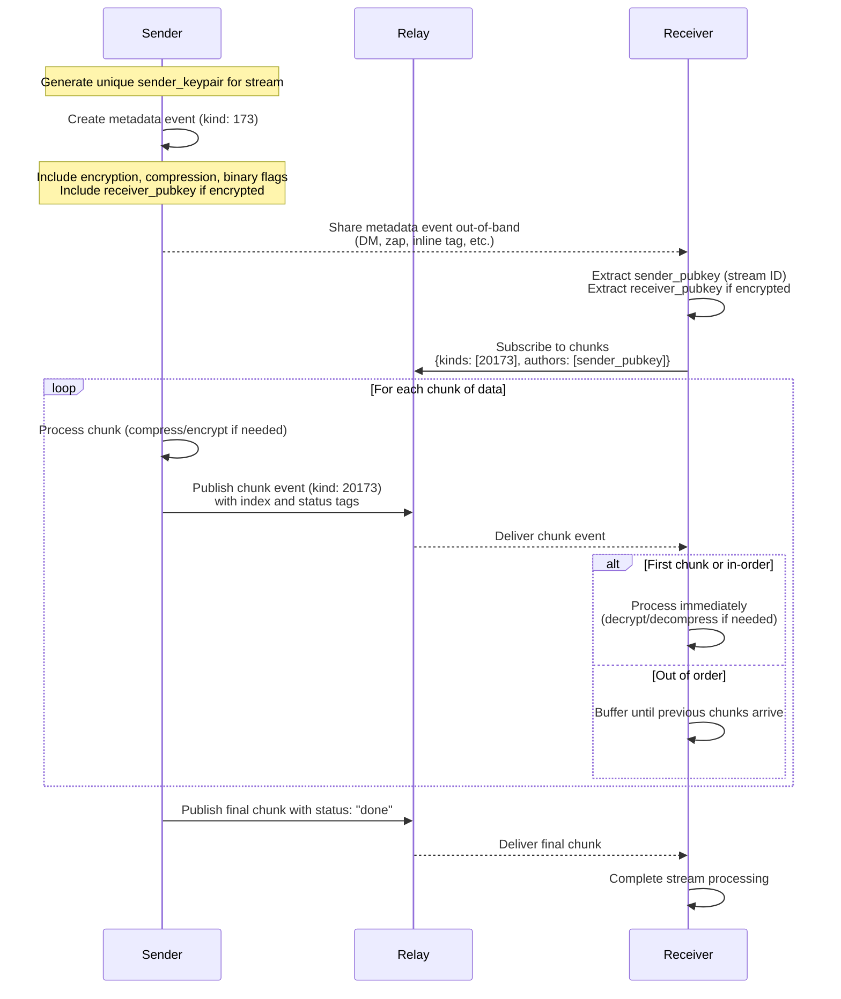

# NIP-173: Streaming Over Nostr via Ephemeral Events

## Status

Draft

## Summary

This NIP defines a mechanism for streaming large or dynamic payloads over Nostr using ephemeral events (`kind: 20173`). It introduces a clear separation between stream metadata (delivered out-of-band) and stream chunks delivery. This design supports optional extensible encryption (`NIP-44` defined here) and compression (`gzip` defined here), and works efficiently with both string and binary payloads.

Streams are unidirectional: the sender signs all events; the receiver decrypts (if encryption is used) and processes them incrementally. The system supports both private (encrypted) and public (plain) streams, and can be reused by other NIPs and protocols (e.g., LLM output, real-time video/audio, file transmission).

This NIP assumes that receivers are actively listening (otherwise they might miss ephemeral events), the logic for signalling online status between sender and receiver is out of scope and is up to the applications.

This NIP does not provide a way for slow receivers to push back, the default assumption is that applications will choose relays that buffer ephemeral events long enough for slow receivers to catch up. 

This NIP operates on a byte stream, implementations shouldn't assume chunks delimit specific messages or packets, unless explicitly defined by specific applications and supported by the libraries used in those cases.

---

## Goals

* Enable real-time and incremental streaming of payloads over Nostr.
* Ensure sender authentication and integrity of streamed data.
* Support string and binary payloads.
* Support optional encryption using asymmetric keys (`NIP-44`).
* Support optional compression.
* Prevent unauthorized chunk injection and abuse.
* Keep chunk events small, self-contained, and verifiable.
* Allow streams to be publicly discoverable or privately shared.
* Allow sharing/delegation of encrypted streams by sharing the decryption key.

---

## Stream Metadata Event (`kind: 173`)

Each stream must be initialized with a **metadata event** (`kind: 173`) signed by the stream sender (`sender_pubkey`) - a random key dedicated to this specific stream. This event is **not part of the stream itself** and is used to publish or deliver stream metadata to receivers. The current protocol version is specified in `version` tag and is equal to **"1"**, clients should check the version tag and ignore/complain about unrecognized versions.

### Required Metadata

The metadata event MUST include the following tags:

* `["version", "1"]`: specifies the version of this protocol.
* `["encryption", "none" | "nip44"]`: encryption scheme used for this stream.
* `["compression", "none" | "gzip"]`: compression format used per chunk.
* `["binary", "true" | "false"]`: whether original data is binary. Used for decoding.
* `["receiver_pubkey", <pubkey>]`: **only when `encryption` is used**. This is the pubkey for which the sender will encrypt the stream. It might be a pubkey of an existing Nostr identity, or a pubkey for a single-use stream decryption key. In the latter case, the decryption key should be securely delivered to receiver out-of-band.

### Optional Tags

* `["relay", <wss://relay.example>]`: relays where chunk events are published (one relay per tag).
* Any application-specific metadata (e.g., format, media type, title, etc.).

### Notes

* The `sender_pubkey` (event.pubkey) serves as the **stream ID**.
* This event must be delivered **out-of-band** — e.g., via a direct message (DM), zap invoice, inline tag in another event, or posted to a relay.
* `sender_pubkey` **must be unique per stream** to avoid linkability across streams.
* All chunk events MUST be signed with the matching `sender_privkey`.

---

## Stream Chunk Events (`kind: 20173`)

Each chunk of the stream is published as a separate event of `kind: 20173`, signed by the `sender_privkey`. Each chunk except the first one includes `prev` tag with the event id of previous chunk - this helps resolve the proper "branch" if the sender sends several streams using the same metadata.

### Event Identity

* The `sender_pubkey` is the stream ID and all chunk events must be signed by the corresponding `sender_privkey`.
* Clients MUST use filter:

```json
{ "kinds": [20173], "authors": [<sender_pubkey>] }
```

to subscribe to the stream.

### Required Tags

* `["i", <index>]`: stringified integer index of the chunk, starting from `"0"`.
* `["status", "active" | "done" | "error"]`: state of the chunk and stream.
* `["prev", <previous_event.id>]`: if index > 0, contains id of previous event to resolve branches.

### Optional Tags

Applications may add other tags to signal chunk metadata, like a timestamp or key-frame flag.

### Content

* If `status: active` or `done`: the `content` field contains the payload (possibly compressed and/or encrypted).
* If `content` is empty, such an event should be treated as keep-alive ping or status update.
* If `status: error`: the `content` must be a JSON string:

```json
{
  "code": "<error_code>",
  "message": "<description>"
}
```

---

## Client Stream Processing

To consume a stream:

1. Obtain the `kind: 173` metadata event (via DM, relay, zap, etc.).
2. Extract the `sender_pubkey` as the stream ID and relays to subscribe to.
3. If `encryption` is used, ensure client possesses a private key matching `receiver_pubkey` tag (received out-of-band, matches the client's identity, etc).
4. Request and subscribe to: `{ "kinds": [20173], "authors": [sender_pubkey] }`
5. Buffer incoming events until chunk `index: 0` is received (or appropriate starting point such as a keyframe, depending on application use-case).
6. For each chunk:
   * Decrypt (if encrypted) using the private key matching `receiver_pubkey`.
   * Decompress (if compressed).
   * Process and release memory.
7. Stop streaming when:
   * A chunk has `["status", "done"]` or `["status", "error"]`
   * TTL expires (recommended `60 seconds` since last chunk, send empty chunks as pings)
   * Buffer exceeds application-defined limits

Below is the diagram of the process described above:



---

## Encryption and Compression Semantics

Compression, encryption and binary-to-string encoding MUST be applied **per chunk**. This ensures each chunk is self-contained and can be processed incrementally.

The interfaces defined below allow for extensibility, but also avoid unnecessary transformations. Some complexity is added by `NIP-44` encryption that expects `string` (not bytes) as input.

### Interfaces

```ts
// encrypt/decrypt
enc(type: string, data: string | Uint8Array) => string
dec(type: string, data: string, binary: boolean) => string | Uint8Array

// compress/uncompress
zip(type: string, data: string | Uint8Array) => Uint8Array
unz(type: string, data: Uint8Array, binary: boolean): string | Uint8Array

// binary/string encoding
bin2str(data: Uint8Array) => string
str2bin(data: string) => Uint8Array
```

Defined encryption and compression types are covered below. Apps may extend the list with new types as long as the new algorithms comply with interfaces defined above.

Binary-to-string encoding is **base64 with padding** (`bin2str` and `str2bin`).

Decryption `dec` and decompression `unz` must return bytes if `binary: true`, otherwise `string`.

The reason encryption returns a string is that it's the final stage of the encoding sequence and Nostr events only allow strings as payloads. NIP-44 is already required to produce a string, other encryption schemes might need to apply base64 or similar to the ciphertext.

The reason compression returns byte array is to avoid additional transformations between compression and encryption steps - most encryption schemes would expect byte arrays as input (except for NIP-44, unfortunately).

Methods implementing these interfaces (compression, encryption, binary/string encoding) **must be applied in a precise sequence** to produce valid results and avoid unnecessary transformations. See Appendix for pseudocode for `send` and `recv` functions, specifying the sequence.

---

## Defined Compression Types

### `"none"`

* No compression.

### `"gzip"`

* Payload is compressed using GZIP (RFC 1952).

---

## Defined Encryption Types

### `"none"`

* No encryption.

### `"nip44"`

* Follows the standard `NIP-44` algorithm.
* Encrypts using the sender's `sender_privkey` and the `receiver_pubkey` shared in stream metadata event.
* Since `NIP-44` expects UTF-8 as input, if input is `binary`, the implementations must apply `bin2str` before encryption and `str2bin` after decryption.

NOTE: `NIP-44` max payload size is 64KB, senders should limit chunk sizes accordingly. 

---

## Chunk sizes

Chunk sizes are practically constrained by Nostr event size limits enforced by relays, ranging from 256KB to 1024KB on most public relays. Encryption and compression schemes might add other limits (as with NIP-44 explained above). Implementations must ensure the byte stream is split into chunks in accordance with the encryption and compression scheme, and may apply the default resulting event size limit of 256KB.

## Buffering

Chunk events may arrive out of order, receiver must buffer events until it receives the chunk with `index: 0` (or keyframe, etc). Limits must be enforced on buffer sizes to protect from abuse.

## Abuse Protection

Clients SHOULD implement safeguards to protect against denial-of-service:

* Maximum number of active streams.
* Max number of buffered chunks per stream.
* TTL for incomplete streams (60 seconds recommended).
* Limit to known `sender_pubkey` values only (via metadata).
* Reject chunks with invalid or unexpected content format.

---

## Example Metadata Event

```json
{
  "kind": 173,
  "pubkey": "a1b2c3d4...stream_pubkey...",
  "tags": [
    ["version", "1"],
    ["encryption", "nip44"],
    ["compression", "gzip"],
    ["binary", "true"],
    ["receiver_pubkey", "b7e1c3...hex..."],
    ["relay", "wss://example-stream.nostr.com"]
  ],
  "content": "",
  "created_at": 1728383600,
  "sig": "..."
}
```

## Example Chunk Event

```json
{
  "kind": 20173,
  "pubkey": "a1b2c3d4...stream_pubkey...",
  "tags": [
    ["i", "0"],
    ["status", "active"]
  ],
  "content": "3F0bFmdHYzNz...encrypted_base64...",
  "created_at": 1728383610,
  "sig": "..."
}
```

---

## Future Extensions

* Additional encryption schemes (e.g., `xchacha20-poly1305`) can be defined with similar semantics.
* Future compression formats (e.g., `lz4`, `brotli`) can be added.
* Standard app-specific tags (e.g., timestamps, keyframes) can be proposed in separate NIPs.

## Appendix

The sending and receiving algorithms defined below must be implemented precisely to cover all combinations of text/binary data and compression/encryption schemes and to avoid unnecessary transformations.

### Sending Pseudocode

```ts
// "data" must be Uint8Array if stream has `binary: true` flag.
send(data: string | Uint8Array, enc_type: string, compr_type: string): string {
    const zipped_data = compr_type ? zip(compr_type, data) : data;
    if (!enc_type) {
        const binary = typeof data !== "string";
        return (binary || compr_type) ? bin2str(zipped_data) : zipped_data;
    } else {
        return enc(enc_type, zipped_data);
    }
}
```

### Receiving Pseudocode

```ts
// Returned value will be Uint8Array if stream has `binary: true` flag.
recv(data: string, binary: boolean, enc_type: string, compr_type: string): string | Uint8Array {
    const binary_or_compr = binary || compr_type;
    const decoded_data = (!enc_type && binary_or_compr) ? str2bin(data) : data;
    const decrypted_data = enc_type ? dec(enc_type, decoded_data, binary_or_compr) : decoded_data;
    return compr_type ? unz(compr_type, decrypted_data, binary) : decrypted_data;
}
```
