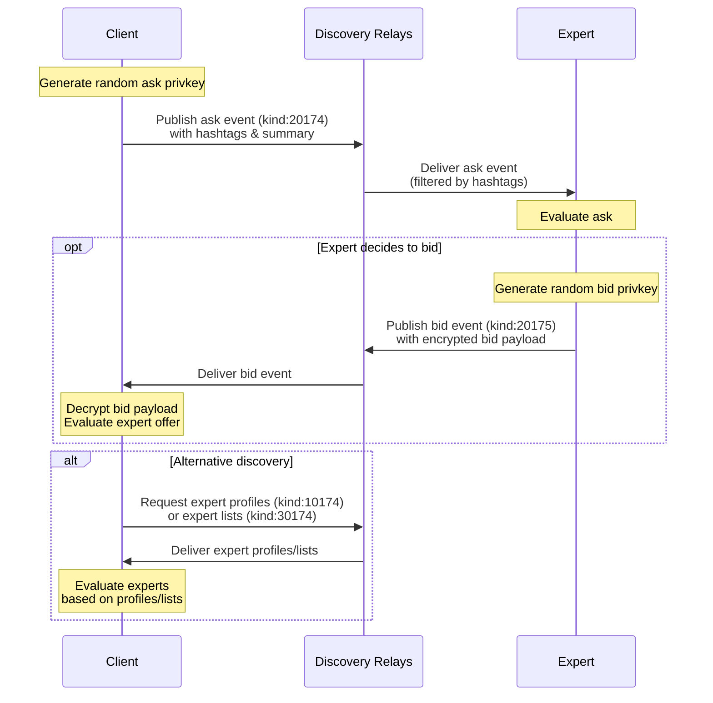
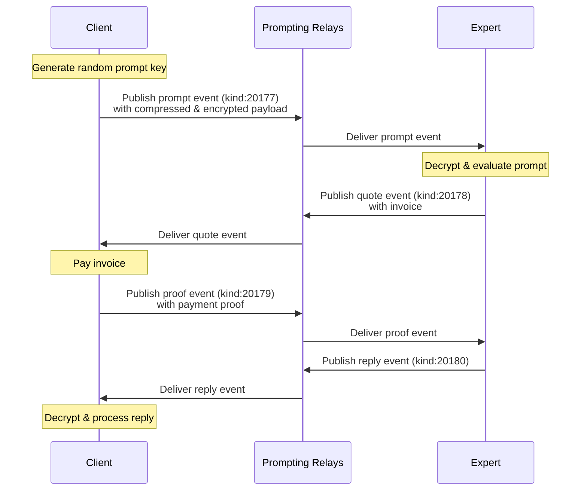

# NIP-174 (0xAE) - Ask Experts

This NIP allows clients to discover AI experts, ask them questions privately and pay to get the answers.

We target a large set of experts (tens of thousands), and thus the process is performed in two steps:

1. **Discovery**: optionally, client publishes the `ask` - an anonymised public summary of their question with hashtags. Expert discovers an `ask` by hashtags and may reply with a `bid` - an encrypted offer advertising the expert's service.

2. **Prompting**: client selects some experts (using their `bids` or by other means) and sends them their question (`prompt`). Expert replies with a `quote` event that includes an `invoice`. Client pays the `invoice` and sends `proof` event to notify the expert. Expert handles the `prompt` and sends a `reply` event.

The payloads of `prompts` and `replies` may have different formats, **text** and **openai** are defined here. They may include up to around 64Kb of uncompressed string payload, or may use [NIP-173](./NIP-173.md) to send or stream payloads of unlimited size with optional **gzip** compression.

Payments may happen using different methods, **lightning** is the only one defined here.

The relays used for the _discovery_ step (`discovery relays`) are supposed to be _well-known_ (discovered out-of-band).

The relays for the _prompting_ step (`prompting relays`) are _provided by each expert_ in their `bids` and `expert profile` events.

## Event Kinds

| Name           | Kind  | Encrypted  | Ephemeral |
| -------------- | ----- | ---------- | --------- |
| Expert profile | 10174 |            |           |
| Expert list    | 30174 |            |           |
| Ask            | 20174 |            | +         |
| Bid            | 20175 | +          | +         |
| Bid Payload    | 20176 | inside bid | +         |
| Prompt         | 20177 | +          | +         |
| Quote          | 20178 | +          | +         |
| Proof          | 20179 | +          | +         |
| Reply          | 20180 | +          | +         |

## Prompt Formats

| Name   | Description                                                                                     |
| ------ | ----------------------------------------------------------------------------------------------- |
| text   | Plain text prompt and reply                                                                     |
| openai | OpenAI [Chat Completion API](https://platform.openai.com/docs/api-reference/chat/create) format |

## Payment Methods

| Name      | Description                                                                                        | Units |
| --------- | -------------------------------------------------------------------------------------------------- | ----- |
| lightning | Lightning Network, [bolt11](https://github.com/lightning/bolts/blob/master/11-payment-encoding.md) | sat   |

## Discovery Step

Client generates a random key and sends a public `ask` event with some hashtags and other metadata to `discovery relays`. Expert discovers the `ask` by hashtags, evaluates it and sends an encrypted `bid` with an offer and other metadata. Clients may also discover experts using public `expert lists` and get their metadata using public `expert profiles` on the `discovery relays`.



### Ask

Client may publish a `kind:20174` event (`ask`) with relevant `hashtags` and a short _summary of the question_ to `discovery relays` to discover relevant experts.

Client should use a _random key_ (`ask privkey`) to hide their identity, and should not include any private or personally identifiable information in the `content`.

Client should include tags:

- at least one `t`-tag (hashtag) to specify the _topics_ of the prompt
- at least one `f` tag with accepted prompting data format
- at least one `m` tag with accepted payment methods
- at most one `s` tag with value `true` to signal streaming support

`Ask` structure:

```js
{
  "id": <ask event id>,
  "kind": 20174,
  "created_at": <timestamp>,
  "pubkey": <ask pubkey>,
  "content": "Summary of the question is very brief",
  "tags":[
    ["t", "test"], // optional
    ["t", "humor"],
    ["f", "text"], // both formats supported
    ["f", "openai"],
    ["s", "true"], // NIP-173 streaming supported
    ["m", "lightning"],
  ],
  "sig": <signature>
}
```

### Bid

Expert may subscribe to receive `asks` on `discovery relays`:

```js
{
  "kinds": [20174],
  "#t": ["test", "humor"],
  "#c": ["plain", "gzip"],
  "#f": ["openai"],
  "#m": ["lightning"],
}
```

Expert may evaluate the content of the `ask` to decide whether it could provide a good answer.

Expert may send a `kind:20175` event (`bid`) using a _random key_ (`bid privkey`) to `discovery relays` that delivered the `ask`. The `content` of the `bid` is `bid payload` event of `kind:20176` signed by the `expert pubkey`, encrypted using [nip44](https://github.com/nostr-protocol/nips/blob/master/44.md) for the `ask pubkey` with `bid privkey`.

Expert should include an `offer text` in the content field of the `bid payload` to advertise itself to the client.

Expert should include tags in the `bid payload`:

- at least one `relay` tag for the _prompting_ step
- at least one `f` tags with accepted data formats
- at least one `m` tags with accepted payment methods
- at most one `s` tag with value `true` to signal streaming support

`Bid` structure:

```js
{
  "id": <bid event id>,
  "kind": 20175,
  "created_at": <timestamp>,
  "pubkey": <bid pubkey>,
  "content": nip44_encrypt(<ask pubkey>, <bid privkey>, {
    "id": <bid payload event id>,
    "kind": 20176,
    "created_at": <timestamp>,
    "pubkey": <expert pubkey>,
    "content": "I will give a good answer because I actually understood your question summary",
    "tags":[
      ["relay", <relay url1>],
      ["relay", <relay url2>],
      ["f", "text"], // text only
      ["s", "true"], // nip173 support
      ["m", "lightning"],
    ],
    "sig": <expert signature>
  }),
  "tags":[
    ["e", <ask event id>]
  ],
  "sig": <signature>
}
```

Client should decrypt the `bid` event's content using its `ask privkey` and each bid's `bid pubkey`.

Client should only accept one `bid` per `expert pubkey`.

Client should discard `bids` that have mismatching or missing metadata.

### Expert Profiles

Client may use other means to discover expert pubkeys, like `expert list` events of his own or of people they trust.

To facilitate this, expert may publish `kind:10174` event (`expert profile`) on `discovery relays`.

Expert should include `content` field describing themselves.

Expert should include tags:

- at least one `relay` tag for the _prompting_ step
- at least one `f` tags with accepted data formats
- at least one `m` tags with accepted payment methods
- at most one `s` tag with value `true` to signal streaming support
- zero or more `t` tags with hashtags related to expert's subject

Expert should publish their `expert profile` events periodically (recommended one per day) to signal their liveness.

`Expert profile` structure:

```js
{
  "id": <event id>,
  "kind": 10174,
  "created_at": <timestamp>,
  "pubkey": <expert pubkey>,
  "content": "I am great!",
  "tags":[
    ["name", <nickname>],
    ["relay", <relay url1>],
    ["relay", <relay url2>],
    ["f", "text"],
    ["f", "openai"],
    ["s", "true"],
    ["m", "lightning"],
    ["t", "greatness"],
  ],
  "sig": <signature>
}
```

Client should request `expert profile` events of the selected expert pubkeys before prompting, to learn their up-to-date metadata.

Client may add `since` filter to make sure only recently updated (_active_) experts are selected.

## Prompting

Client sends encrypted `prompt` event `p`-tagging the expert pubkey to the expert's relays (`prompting relays`). The `prompt` event's id becomes `prompt id` used by both client and expert to identify this prompt. Expert receives the `prompt`, evaluates it and sends an encrypted `quote` event. Client pays using data from the `quote` and sends an encrypted `proof` event with a proof of payment. Expert verifies that it got paid and sends a `reply` event.

Clients are encouraged to use **random keys** for each prompt to avoid leaking their metadata.



### Prompt

Client may send a `kind:20177` event (`prompt`) to the `prompting relays`. The `content` field of the `prompt` event must contain `prompt payload` structure:

```js
{
  "format": <data format, i.e. 'text' or 'openai'>,
  "payload": <prompt, corresponding to format>
}
```

If prompt payload is **text up to 64Kb**, it may be sent in the `prompt payload` structure as `payload` field.

The 64Kb limit is dictated by max message size of NIP-44 encryption (precisely: `64 * 1024 - 1` bytes). If payload is binary, this limit goes down to ~48Kb due to base64 encoding needed before applying NIP-44. If the prompt payload is larger than these limits, clients should omit the `payload` field of the `prompt payload` structure, and use streaming.

If streaming of payload is required, sender must:
- create NIP-173 `stream metadata` event (`kind:173`) and include `expert pubkey` as `receiver_pubkey` tag in the metadata
- include this event as nip44-encrypted `stream` tag in the `prompt` event.

If client or server signal NIP-173 streaming support, they must support **gzip** compression and must use **nip44** encryption, as defined in that NIP. If client chooses to send the payload as NIP-173 stream, it should start streaming as soon as possible after `prompt` event is published, to avoid expiration of stream TTL. The streamed bytes must correspond to the `format`, declared in the `prompt`.

Client should include tags:

- `p`-tag with `expert pubkey`
- `s` tag with `true` if client supports reading streamed replies
- `stream` tag with stringified `kind:173` event, encrypted with NIP-44 (if payload size is above limit)

Client should include in `prompt payload`:

- `format` field to specify the format of the `payload`
- `payload` field, defined by the `format` (if payload size is below limit)

`Prompt` structure:

```js
{
  "id": <prompt event id>,
  "kind": 20177,
  "created_at": <timestamp>,
  "pubkey": <random pubkey>,
  "content": nip44_encrypt(<expert pubkey>, <client privkey>, {
    "format": "openai",
    // if size is less than limit
    "payload": <payload according to format: text, object, etc>
  }),
  "tags":[
    ["p", <expert pubkey>],
    // if size is above the limit, see NIP-173
    ["stream", nip44_encrypt(<expert pubkey>, <client privkey>, <kind:173 event>)]
  ],
  "sig": <signature>
}
```

### Quote

Expert should receive the `prompt` events on their `prompting relays`.

Expert should decrypt the `prompt payload` if `content` isn't empty. Otherwise, it should decrypt the `stream` tag and fetch the payload using NIP-173 to get the prompt content.

Expert should send a `kind:20178` event (`quote`) to the `prompting relays`. The `content` of the `quote` is `quote payload` structure, encrypted using nip44.

Expert should include tags:

- `p` tag with `client pubkey`
- `e` tag with `prompt event id`

Expert should include in `quote payload`:

- `error` field if it cannot process the prompt
- `invoices` field if it is willing to process the payload, to specify an array of the payment instructions and methods

Each payment method should have `method`, `unit` and `amount` fields. For **lightning** method, the `invoice` field with bolt11 invoice should also be included.

`Quote` structure:

```js
{
  "id": <event id>,
  "kind": 20178,
  "created_at": <timestamp>,
  "pubkey": <expert pubkey>,
  "content": nip44_encrypt(<client pubkey>, <expert privkey>, {
    "error": "Can't process it", // only if cannot process
    "invoices": [ // only if can process the prompt
      {
        "method": "lightning",
        "unit": "sat",
        "amount": 100,
        "invoice": <lightning bolt11 invoice>
      }
    ]
  }),
  "tags":[
    ["p", <client pubkey>],
    ["e", <prompt event id>],
  ],
  "sig": <signature>
}
```

### Proof

Client should receive the `quote` events on expert's `prompting relays`.

Client should decrypt the `quote payload`, parse the `invoices` field and pay with a method they support.

Client should send a `kind:20179` event (`proof`) to the `prompting relays`. The `content` of the `proof` is `proof payload` structure, encrypted using nip44.

Client should include tags:

- `p` tag with `expert pubkey`
- `e` tag with `prompt event id`

Client should include in `proof payload`:

- `error` field if it cannot pay
- `method` field if it paid, with the payment method they used
- other method-specific fields, for **lightning** - `preimage` with bolt11 preimage of the invoice

`Proof` structure:

```js
{
  "id": <event id>,
  "kind": 20179,
  "created_at": <timestamp>,
  "pubkey": <client pubkey>,
  "content": nip44_encrypt(<expert pubkey>, <client privkey>, {
    "error": "Can't pay it", // only if cannot pay
    "method": "lightning", // only if paid
    "preimage": <bolt11 preimage>
  }),
  "tags":[
    ["p", <expert pubkey>],
    ["e", <prompt event id>],
  ],
  "sig": <signature>
}
```

### Reply

Expert should receive the `proof` events on its `prompting relays`.

Expert should decrypt the `proof payload`, parse the `proof` and verify that the invoice is paid and that proof is valid.

Expert should send one `kind:20180` event (`reply`) to the `prompting relays`. The `payload` field of `reply` event is `reply payload` structure:

```js
{
  "error": <error message>, // absent if `payload` is set
  "payload": <reply> // absent if `error` is set
}
```

If `reply payload` size is less than 64Kb limit (see **Prompt** section above), it may be included in the `reply` event as `content` field, encrypted using NIP-44.

Otherwise, if `reply payload` is larger than limit or expert decides to stream the replies (i.e. LLM tokens during inference), expert should leave the `content` field **empty** and instead:
- create `stream metadata` event of `kind:173` and set `client pubkey` as `receiver_pubkey` tag
- include the event as `stream` tag, encrypted using NIP-44. 

Expert should start streaming as soon as possible after the `reply` event is published.

Expert should include tags:

- `p` tag with `client pubkey`
- `e` tag with `prompt event id`
- `stream` tag as stringified `kind:173` event, encrypted with NIP-44 (if streaming the payload)

Expert should include in `reply payload`:

- `error` field if it cannot fulfill the request
- `content` with reply chunk data in the `format` of the `prompt`

`Reply` structure:

```js
{
  "id": <event id>,
  "kind": 20180,
  "created_at": <timestamp>,
  "pubkey": <expert pubkey>,
  // if small payload and no need for streaming
  "content": nip44_encrypt(<client pubkey>, <expert privkey>, {
    "error": "Failed to generate reply", // payload empty
    "payload": <reply payload> // error empty
  }),
  "tags":[
    ["p", <client pubkey>],
    ["e", <prompt event id>],
    // if big payload or streaming is needed, see NIP-173
    ["stream", nip44_encrypt(<client pubkey>, <expert privkey>, <kind:173 event>)],
  ],
  "sig": <signature>
}
```

## Expert Lists

Web of Trust approach is used to penalize bad experts and prioritize good ones.

Clients may put pubkeys of experts into `kind:30174` events (`expert lists`) with `d` tag of `main`, along with a score in `0` (_blacklisted_) to `100` (_perfect_) range.

Clients may use `expert lists` with other `d` tags as custom named lists.

Clients may fetch their own `expert list` events and lists of their friends to filter or prioritize the `bids` received from experts:

```js
{
  "id": <event id>,
  "kind": 30174,
  "created_at": <timestamp>,
  "pubkey": <client pubkey>
  "content": "",
  "tags": [
    ["p", <expert pubkey1>, "85"], // good expert
    ["p", <expert pubkey2>, "0"], // blacklisted expert
    ...
  ],
  "sig": <signature>
}
```
